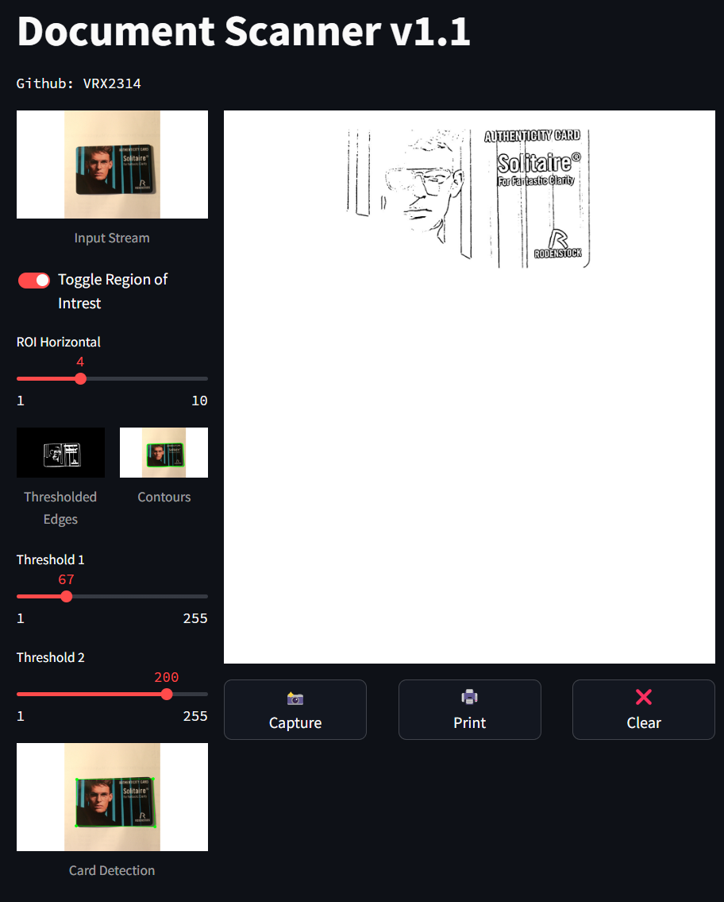
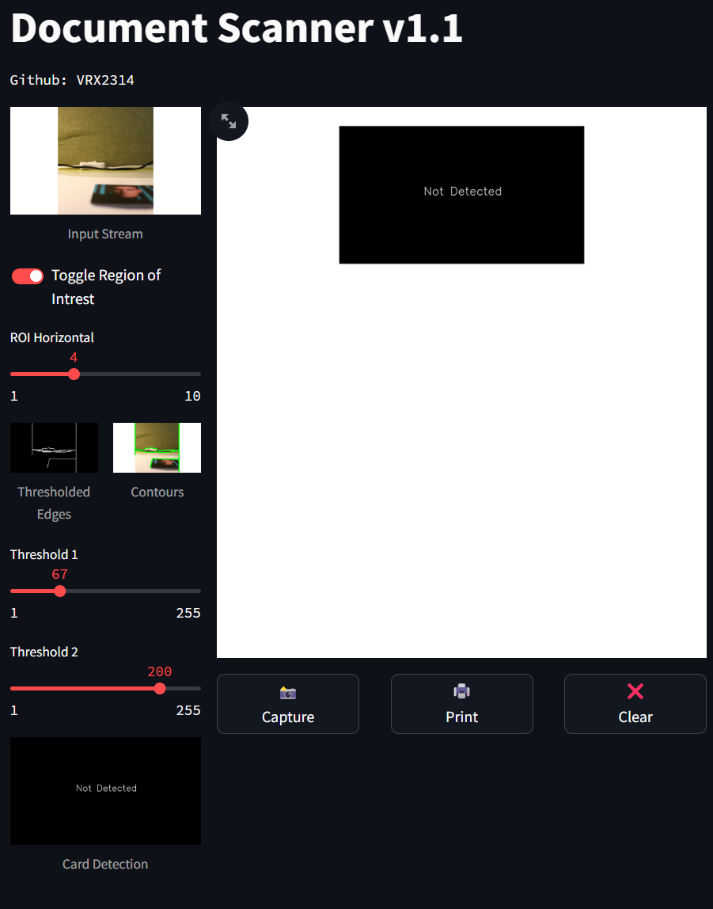

# Document-Scanner-OpenCV-WebApp
A real time document scanner using OpenCV and Python based on Murtaza Hassan's implementation (https://github.com/murtazahassan). UI built using streamlit.

## UI Image Document Present

## UI Image Document Absent
