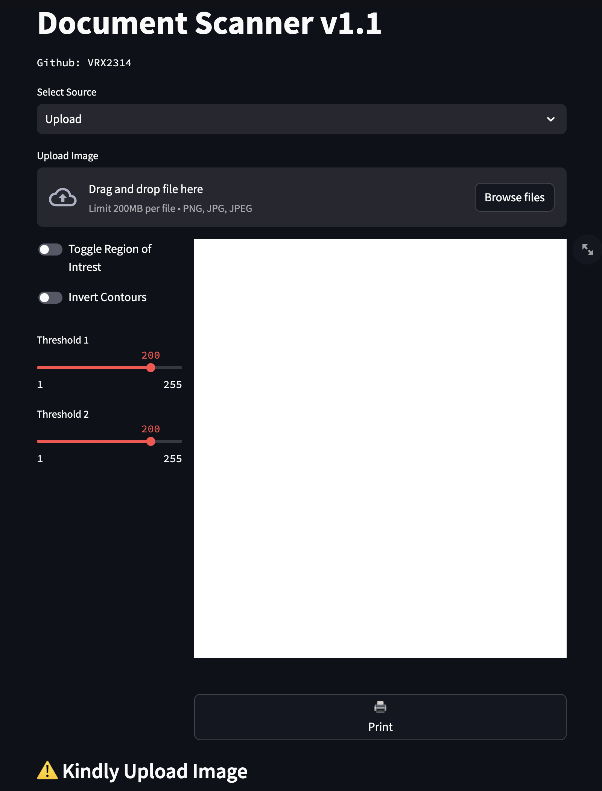
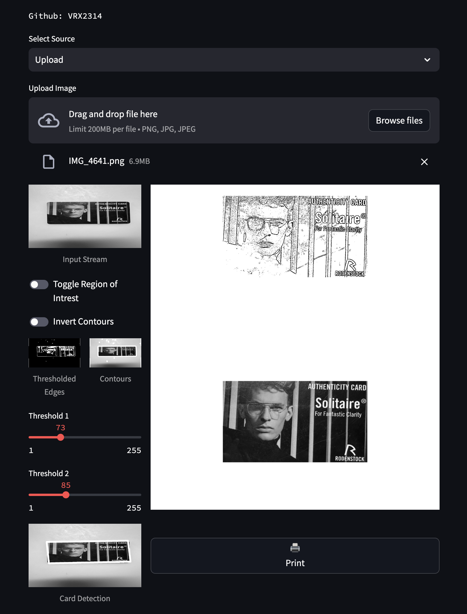
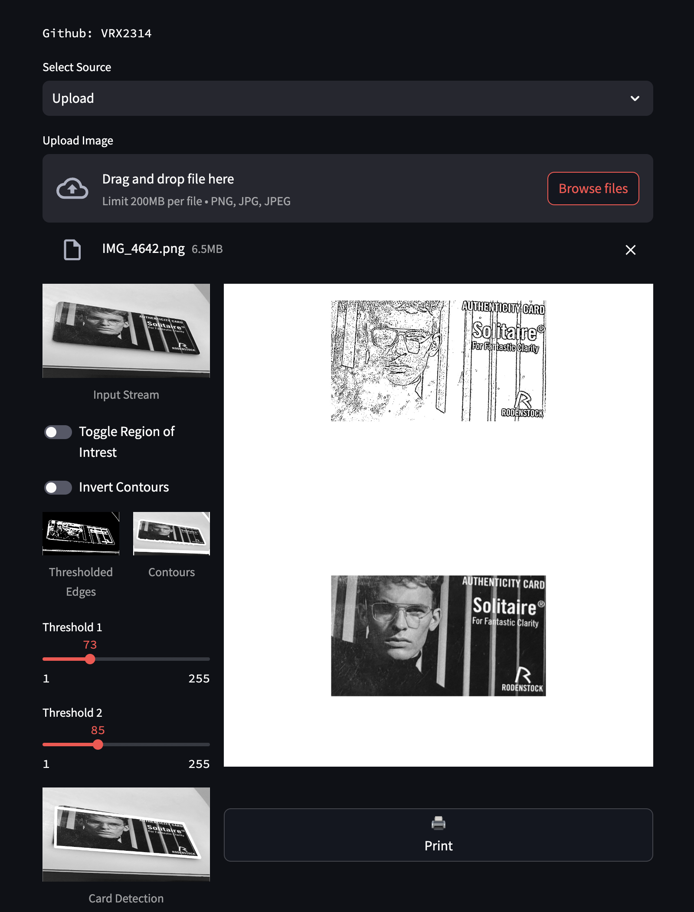
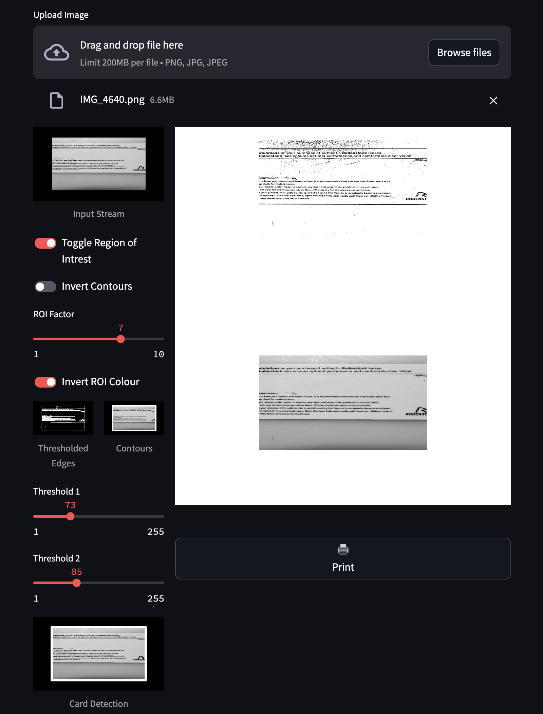
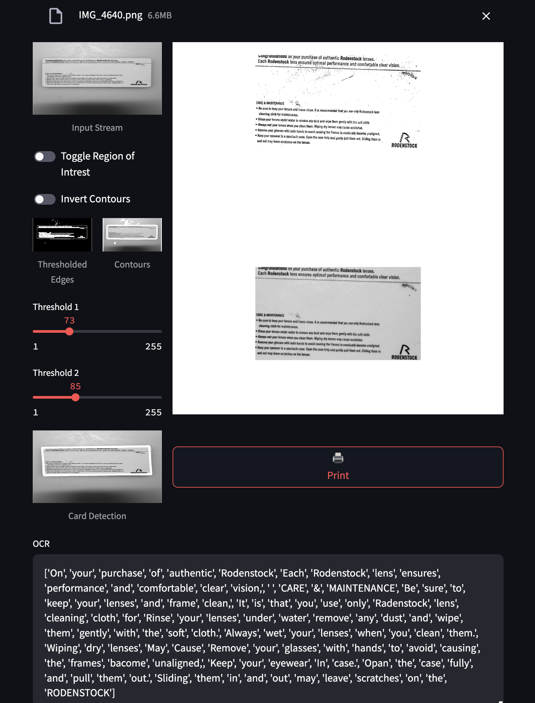

# Document-Scanner-OpenCV-WebApp

An OpenCV based Document Scanner Web Application with OCR features extending upon the implementation of Murtaza Hassan (https://github.com/murtazahassan). OCR processing implemented using Pytesseract model.  UI built using streamlit.

## Preview GIF

## Features

### Upload Mode

No File Upload

After File Upload

### Skew Correction

Skewed Image Correction

### Optical Character Recognition

### ROI for Background Reduction

